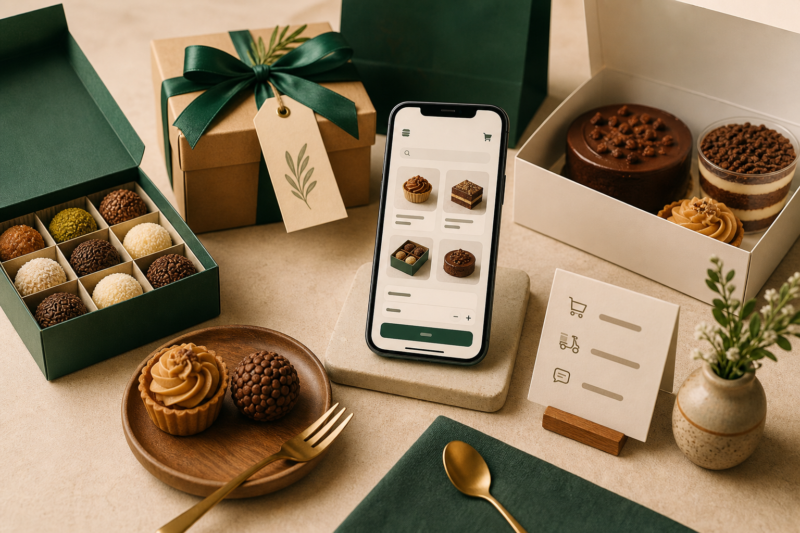

# Loja na Mão

App demo para pequenos comércios venderem pelo WhatsApp com catálogo, carrinho e pedidos organizados.

> Projeto de portfólio com uma vitrine demonstrativa de doceria premium: o cliente escolhe produtos, monta o pedido, envia pelo WhatsApp e o pedido fica registrado para acompanhamento.

## Links

- Demo web: em breve
- Repositório: https://github.com/RyanSDeve/loja-na-mao
- Stack: Flutter, Dart, Supabase, PostgreSQL, WhatsApp

## Problema

Muitos pequenos comércios vendem pelo WhatsApp, mas recebem pedidos desorganizados, sem padrão e sem histórico centralizado. Isso atrasa o atendimento e dificulta acompanhar pedidos.

## Solução

O Loja na Mão é uma base white-label para negócios locais. Nesta demo, ele aparece como **Doce Encanto**, uma doceria que vende caixas de brigadeiros, kits presenteáveis e tortas premium.

- catálogo de produtos com busca e categorias;
- carrinho com resumo do pedido;
- checkout com dados do cliente;
- envio do pedido formatado para WhatsApp;
- registro do pedido para acompanhamento;
- painel do lojista com pedidos recentes;
- cadastro, edição, ativação e exclusão de produtos.

## Resultado esperado para o cliente

- pedidos mais organizados;
- atendimento mais rápido no WhatsApp;
- vitrine mais profissional;
- menos perda de informação;
- base pronta para evoluir com login, estoque, fotos e pagamento.

## Screenshots

Adicione os prints finais nesta pasta:

```text
assets/screenshots/
```

Sugestão de prints:

| Tela | Arquivo |
| --- | --- |
| Vitrine inicial | `assets/screenshots/01-vitrine.png` |
| Busca/filtros | `assets/screenshots/02-busca-filtros.png` |
| Checkout | `assets/screenshots/03-checkout.png` |
| Painel do lojista | `assets/screenshots/04-painel-lojista.png` |

## Visual da demo

O asset principal da vitrine está em:

```text
assets/images/storefront-hero.png
```

Ele foi criado para dar contexto comercial ao app: produto local, embalagem presenteável, checkout no celular e sensação de pedido pronto para WhatsApp.



## Funcionalidades

- Modo demo sem Supabase, usando dados locais.
- Modo conectado ao Supabase via `--dart-define`.
- Tabelas para lojas, produtos, pedidos e itens do pedido.
- Painel de catálogo com criação, edição, ativação/desativação e exclusão de produtos.
- Row Level Security habilitado.
- Políticas de demonstração para leitura pública, criação de pedidos e manutenção do catálogo.
- Layout responsivo para mobile e web.

> Observação de segurança: as políticas atuais facilitam a demonstração pública do CRUD. Em um app vendido para cliente real, o próximo passo é adicionar login do lojista com Supabase Auth e restringir alterações por usuário/loja.

## Backend Supabase

O schema inicial está em:

```text
supabase/schema.sql
```

Se você já rodou uma versão antiga da demo e quer limpar os dados antigos, use:

```text
supabase/reset_demo_data.sql
```

Tabelas principais:

- `stores`: dados da loja;
- `products`: catálogo;
- `orders`: pedidos;
- `order_items`: itens do pedido, com nome e preço salvos como histórico da venda.

## Como rodar

Instale as dependências:

```bash
flutter pub get
```

Rode em modo demo:

```bash
flutter run -d chrome
```

Rode conectado ao Supabase:

```bash
flutter run -d chrome --dart-define=SUPABASE_URL=SUA_URL --dart-define=SUPABASE_ANON_KEY=SUA_ANON_KEY
```

Gere build web:

```bash
flutter build web --release --dart-define=SUPABASE_URL=SUA_URL --dart-define=SUPABASE_ANON_KEY=SUA_ANON_KEY
```

O build fica em:

```text
build/web
```

## Como apresentar para clientes

Pitch curto:

> Desenvolvi uma demo de app para pequenos comércios venderem pelo WhatsApp com catálogo, carrinho e pedidos salvos para acompanhamento. A mesma estrutura pode ser adaptada para restaurantes, lojas, docerias, serviços locais e pequenos negócios.

## Próximas evoluções

- Login do lojista com Supabase Auth.
- Upload de fotos com Supabase Storage.
- Status do pedido em tempo real.
- Dashboard de vendas.
- Tema personalizável por loja.

## Documentação do portfólio

- [Passo a passo de publicação](docs/passo-a-passo-publicacao.md)
- [Checklist de portfólio](docs/checklist-portfolio.md)
- [Roteiro de vídeo](docs/roteiro-video.md)
- [Texto para 99freelas](docs/texto-99freelas.md)
